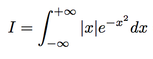
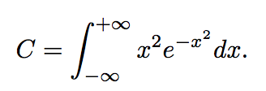

# for-science

This repository contains examples implementation of Metropolis method for computing integrals, using Fortran.

* the file integral1.f90 contains source code for compulating the following integral :

* the file integral2.f90 contains source code for computing the following integral :

* the file pi_monte_carlo.f90 contains source code for computing the vaue of pi using monte carlo method
